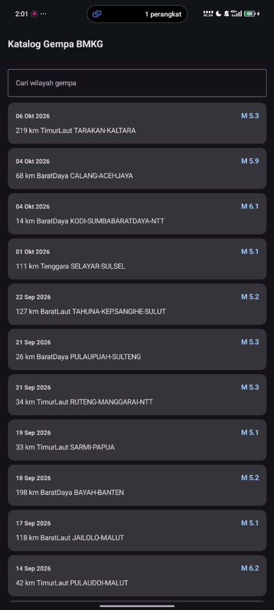
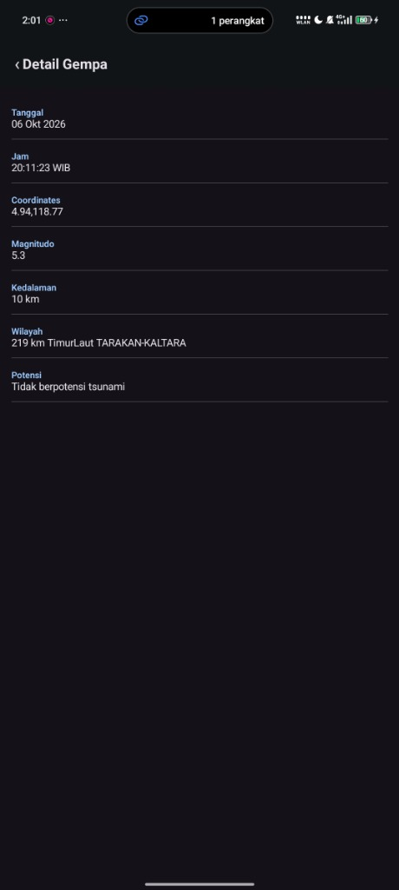

# Katalog Gempa BMKG

Aplikasi Android berbasis Jetpack Compose untuk melihat dan memantau katalog informasi gempa bumi terkini langsung dari REST API resmi BMKG secara dinamis dan real-time.

---

## 📱 Screenshot Aplikasi

| Home Screen (Katalog & Pencarian) | Detail Screen (Informasi Lengkap) |
| :---: | :---: |
|  |  |


---

## ✨ Fitur Utama

- **Live Data BMKG**: Mengambil dan menampilkan data gempa terkini langsung dari server terbuka BMKG tanpa API key.
- **Pencarian Cepat (Local Search)**: Filter pencarian lokal secara dinamis berdasarkan nama wilayah gempa.
- **State-Driven UI**:
  - **Loading State**: Animasi indikator progres saat memuat data.
  - **Success State**: Tampilan daftar gempa menggunakan `LazyColumn`.
  - **Empty State**: Informasi bila pencarian wilayah tidak ditemukan.
  - **Error State**: Pesan error beserta tombol coba lagi (*Retry*).
- **Detail Gempa**: Menampilkan parameter lengkap gempa (Tanggal, Jam, Koordinat, Magnitudo, Kedalaman, Wilayah, dan Potensi Tsunami).
- **Dark & Light Mode Support**: Mendukung skema warna kustom Material Design 3.

---

## 🏛️ Arsitektur Aplikasi (MVVM)

Aplikasi dibangun mengikuti pola arsitektur **Model-View-ViewModel (MVVM)** sesuai kaidah Android Modern Development:

```text
[ View / Composable (UI) ] 
         ↕ (StateFlow / Event)
[ ViewModel (GempaViewModel) ]
         ↕ (Suspend Functions / Coroutines)
[ Repository (GempaRepository) ]
         ↕
[ Remote API Service (BmkgApiService) ]
         ↕ (HTTP REST API)
[ BMKG Public API Server ]
```

- **View**: Dibangun murni menggunakan Jetpack Compose, mengamati perubahan `uiState` secara reaktif dan tidak memanggil API langsung.
- **ViewModel**: Mengatur state UI dengan `StateFlow` dan menangani lifecycle coroutine via `viewModelScope`.
- **UiState**: Menggunakan `sealed interface GempaUiState` (`Loading`, `Success`, `Error`).
- **Repository**: Mengabstraksi sumber data dari API Retrofit.

---

## 🌐 Sumber API (BMKG)

- **Base URL**: `https://data.bmkg.go.id/`
- **Endpoint**: `DataMKG/TEWS/gempaterkini.json`
- **Full URL**: `https://data.bmkg.go.id/DataMKG/TEWS/gempaterkini.json`
- **Struktur JSON**: `Infogempa.gempa[]`

---

## 🛠️ Spesifikasi Teknis & Dependensi

- **Bahasa**: Kotlin (fitur Data Class, Null Safety, Lambda, Sealed Interface)
- **UI Toolkit**: Jetpack Compose & Material Design 3
- **Navigasi**: Navigation Compose (`NavHost`, `composable`)
- **Networking**: Retrofit 2 + Gson Converter
- **Arsitektur & State**: ViewModel Compose + Kotlin Coroutines & StateFlow
- **Permissions**: `android.permission.INTERNET` di `AndroidManifest.xml`
- **Target SDK**: Min SDK 24, Target SDK 35

---

## 🚀 Cara Menjalankan Project

1. Buka folder ini di **Android Studio** (Ladybug / versi terbaru).
2. Tunggu proses **Gradle Sync** selesai.
3. Jalankan aplikasi pada emulator atau perangkat Android fisik (Run 'app').
4. Untuk meng-generate APK debug pengumpulan:
   - Pilih menu **Build > Build Bundle(s) / APK(s) > Build APK(s)**.
   - APK akan tersedia di: `app/build/outputs/apk/debug/app-debug.apk`.
